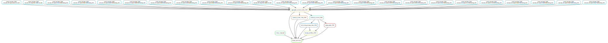

# Summary

Analysis run by [Snakefile](../../Snakefile.txt)
using [this config file](../../config.yaml).
See the [README in the top directory](../../README.md)
for details.

Here is the rule graph of the computational workflow:

Here is the Markdown output of each notebook in the workflow:

1. Get barcode-variant lookup table from previous analysis 

2. Count variants and then aggregate counts for
   [ZIKV](aggregate_variant_counts_ZIKV.md) 
   to create variant counts files for [ZIKV](../counts/ZIKV/variant_counts.csv.gz) 

3. Analyze sequencing counts to cells ratio for [ZIKV](counts_to_cells_ratio_ZIKV.md)
   this prints a list of any samples where this ratio too low. Also
   creates a CSV for [ZIKV](../counts/ZIKV/counts_to_cells_csv.csv) with the
   sequencing counts, number of sorted cells, and ratios for
   all samples.

4. Calculate escape scores from variant counts for [ZIKV](counts_to_scores_ZIKV.md) 

5. Call sites of strong escape for [ZIKV](call_strong_escape_sites_ZIKV.md) 

6. Plot escape profiles for [ZIKV](escape_profiles_ZIKV.md) 

7. Map escape profiles to ``*.pdb`` files using notebooks here for 
   [ZIKV](output_pdbs_ZIKV.md),